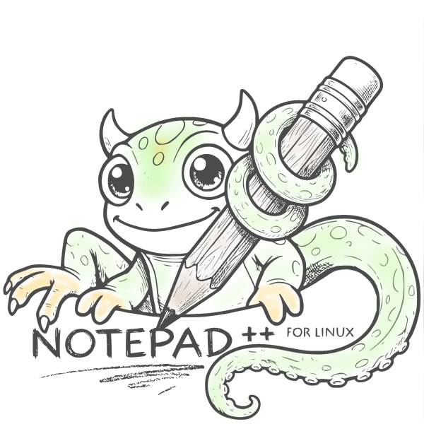

# Notepad++ Linux

<p align="center">
  
</p>

A native Linux port of the Notepad++ text editor, built with Qt6 and QScintilla.

## Overview

Notepad++ Linux brings the core features of Notepad++ to Linux without Wine or compatibility layers. It is built with Qt6 and QScintilla and targets practical feature parity with the Windows version.

## Features

### Editing
- Multi-tab interface with closable, movable, reorderable tabs
- Multi-cursor editing (Ctrl+Click to add cursors, type at all positions)
- Column/block selection (Alt+Drag or Alt+Shift+Arrows)
- Smart highlighting of all occurrences of a selected word
- Line operations: sort, remove duplicates, remove blank lines, join, split, move, duplicate, reverse
- Case conversion: UPPERCASE, lowercase, Title Case, Sentence case, iNVERT cAsE
- Code folding, brace matching, auto-indent, auto-completion
- Word wrap, zoom, current line highlighting

### Search
- Find and replace with regular expression support
- Find in Files with threaded search and clickable results
- Incremental search bar with live match highlighting and count (Ctrl+Alt+I)
- Bookmarks: toggle (Ctrl+F2), navigate (F2/Shift+F2), cut/copy/delete/paste bookmarked lines
- Go to line (Ctrl+G)

### Split View
- Horizontal and vertical split editing
- Move or clone documents between views
- Switch focus between views (F8)

### Syntax Highlighting
Supported languages: C, C++, Python, JavaScript, Java, HTML, CSS, XML, SQL, Bash, JSON, YAML, Perl

### Tools
- Macro recording, playback, and persistent storage with keyboard shortcuts
- Word count and text statistics
- Line ending conversion (CRLF, LF, CR)
- Base64 and URL encode/decode
- MD5 and SHA256 hash generation
- Run Python, JavaScript, or compile C/C++ directly
- Launch HTML in browser

### Document Management
- Session persistence and restore
- Recent files tracking
- Document map (minimap) panel
- External file modification detection
- Encoding support: UTF-8, UTF-16, ANSI
- Backup and auto-save system
- Settings import/export

### Appearance
- Themes: Light, Dark, Monokai
- Customizable fonts and colors
- 10-category preferences dialog
- Status bar with cursor position, selection length, file size, encoding

## Requirements

- Linux (Ubuntu 20.04+ or equivalent)
- Qt6 (6.0+) or Qt5 (5.15+)
- QScintilla2
- CMake 3.16+
- GCC 9+ with C++17 support

### Install Dependencies

```bash
# Ubuntu/Debian (Qt6)
sudo apt install qt6-base-dev qt6-base-dev-tools libqscintilla2-qt6-dev cmake build-essential

# Ubuntu/Debian (Qt5 fallback)
sudo apt install qt5-default libqscintilla2-qt5-dev cmake build-essential
```

## Building

```bash
git clone https://github.com/mixelpixx/notepad-plus-plus-linux.git
cd notepad-plus-plus-linux
mkdir build && cd build
cmake ..
make -j$(nproc)
```

### Install

```bash
sudo make install
```

Installs to `/usr/local/bin/notepadplusplus`.

### Debug Build

```bash
cmake -DCMAKE_BUILD_TYPE=Debug ..
make -j$(nproc)
```

## Usage

```bash
./notepadplusplus                    # Start with empty editor
./notepadplusplus file1.cpp file2.py # Open specific files
```

### Keyboard Shortcuts

| Action | Shortcut |
|--------|----------|
| New file | Ctrl+N |
| Open | Ctrl+O |
| Save | Ctrl+S |
| Close | Ctrl+W |
| Find | Ctrl+F |
| Replace | Ctrl+H |
| Find in Files | Ctrl+Shift+F |
| Incremental Search | Ctrl+Alt+I |
| Go to Line | Ctrl+G |
| Toggle Bookmark | Ctrl+F2 |
| Next Bookmark | F2 |
| Previous Bookmark | Shift+F2 |
| Duplicate Line | Ctrl+D |
| Move Line Up/Down | Alt+Up/Down |
| UPPERCASE | Ctrl+Shift+U |
| lowercase | Ctrl+U |
| Zoom In/Out | Ctrl+Plus/Minus |
| Reset Zoom | Ctrl+0 |
| Start Macro | Ctrl+Shift+R |
| Play Macro | Ctrl+Shift+P |
| Focus Other View | F8 |
| Run Command | F5 |
| Run Python | Ctrl+F1 |
| Run JavaScript | Ctrl+F2 |
| Compile and Run | Ctrl+F5 |

## Project Structure

```
core/               Main application logic
  Application.cpp   Application controller
  MainWindow.cpp    Window, menus, actions
  MainWindow_impl.cpp  Menu action implementations
  EditorWidget.cpp  QScintilla editor wrapper
  MacroManager.cpp  Macro recording and playback
  BackupManager.cpp Auto-save and backup
ui/                 UI components
  FindReplaceDialog.cpp
  FindInFilesDialog.cpp
  IncrementalSearchBar.cpp
  DocumentMapPanel.cpp
  PreferencesDialog.cpp
utils/              Utilities
  ConfigManager.cpp Settings persistence
platform/           Platform abstraction
  LinuxPlatform.cpp
resources/          Application resources
  images/           Logo and icons
```

## Contributing

1. Fork the repository
2. Create a feature branch
3. Follow Qt coding conventions and C++17
4. Submit a pull request

## License

GNU General Public License v3.0 -- see [LICENSE](LICENSE).

## Acknowledgments

- Don Ho -- creator of the original Notepad++
- Qt Project -- application framework
- QScintilla -- text editing component
- Notepad++ community -- feature requirements and testing
